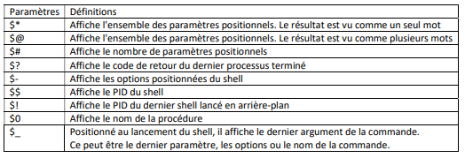
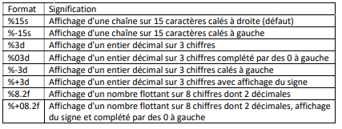

# Lost notes
- VM Hyper-V stopés le derniers jours

# To test
- Tester auto shut down
- Block file type (bat, ps1, CMD, etc)
- Password policy
- Firewall
- OpenVPN IP check

# To do
- Nettoyer [Github ... /note/notes-network.md](https://github.com/Altherneum/.github/blob/main/note/notes-network.md) | [/note/notes-network.md](/note/notes-network.md)
- Routage [Github ... /note/Network/Cisco/routage.md](https://github.com/Altherneum/.github/blob/main/note/Network/Cisco/routage.md)
- infos.md to add on website [Github ... /note/OS/Windows/Active-Directory/infos.md](https://github.com/Altherneum/.github/blob/main/note/OS/Windows/Active-Directory/infos.md)


# Test Approbation de domaine
## Utilisateurs et ordinateurs Active Directory Domaine enfant distant approbation
- Créer une zone `@_M2I` similaire à la façon de faire sur le serveur AD principale

### Partage
- Créer dossier
- Supprimer héritage
- Nouvelle UO (Groupe, utilisateurs, ordinateurs, ...)

### Utilisateurs et ordinateurs
- Dans utilisateurs et Ordinateurs AD
  - Créer UO User etc, partage, etc
  - TO DO -----------------------------------------

## Serveur 1
- Crée groupe dans IT
  - Universelle
  - `U_IT_RW`
  - Ajouter G_IT, dans U_IT
  - Nordine aura accès au ressource d'ETUDE.LOCAL et depuis ETUDE a accès à FORMATION aussi

### Test
Attention pleins de groupes ont étés ajoutés les un dans les autres pour tester le shared folder du domaine enfant ETUDE.LOCAL, mais ne marche pas (Groupe Universel added, and added on ETUDE groups IT)

### Conclusion
Tout a été crée, peut inter connecté des domaines, mais partage de fichier impossible

REGISTER LA ZONE DANS L'AD (Dans DNS) ?????


# CV update
Avec Philipe LAMBERT

---
- Attention aux langages et pré faire des phrases de speech
- Mots clés qui permettent de créer un speech sans relier comme un robot
- Transformer instabilité pro en force
  - Vision globale, adaptivité, expériences multiples
---
- âge
- photo
- Formation en cours date de fin
- Riche ROME pole emploi
- Né avec un clavier entre les mains
- Hobie
- lien si imprimer


# PowerShell
```
$i = 0                # $i = 0
$i++                  # $i is incremented by 1
$j = $i--             # $j takes on the value of $i before the decrement

$a = 1,2,3
$b = 9,8,7
$i = 0
$j = 1
$b[$j--] = $a[$i++]   # $b[1] takes on the value of $a[0], then $j is
                      # decremented, $i incremented

$i = 2147483647       # $i holds a value of type int
$i++                  # $i now holds a value of type double because
                      # 2147483648 is too big to fit in type int

[int]$k = 0           # $k is constrained to int
$k = [int]::MaxValue  # $k is set to 2147483647
$k++                  # 2147483648 is too big to fit, imp-def behavior

$x = $null            # target is unconstrained, $null goes to [int]0
$x++                  # value treated as int, 0->1
```

# Unary
```
# Unary plus
Description:
An expression of the form + unary-expression is treated as if it were written as 0 + unary-expression (§7.7). The integer literal 0 has type int.

This operator is right associative.

Examples:
+123L         # type long, value 123
+0.12340D     # type decimal, value 0.12340
+"0xabc"      # type int, value 2748

# Unary minus
Description:
An expression of the form - unary-expression is treated as if it were written as 0 - unary-expression (§7.7). The integer literal 0 has type int. The minus operator can be any one of the dash characters listed in §7.2.

This operator is right associative.

Examples:
-$true     # type int, value -1
-123L      # type long, value -123
-0.12340D  # type decimal, value -0.12340

# The unary -join operator
Description:
The unary -join operator produces a string that is the concatenation of the value of one or more objects designated by unary-expression. (A separator can be inserted by using the binary version of this operator (§7.8.4.4).)

unary-expression can be a scalar value or a collection.
```


## Variable env
Permet de créer des commandes auto


## Commandes utiles

- `ShowCommand` [Affiche la commande](https://learn.microsoft.com/en-us/powershell/module/microsoft.powershell.utility/show-command?view=powershell-7.4) en mode visuel

- `sconfig` Outil de configuration du serveur
  - CMD ou PS ?


- `bcdedit` (Données de configuration de démarrage)
  - To test
- `mmc` Microsoft Management Console
  - To test


- `Get-ADUser` Utilisateur de l'AD
- `Get`, `Set`, `Add`, `New` ... Lister les props 


# Droit partage
Pour modifier,
Doit avoir droit edit sur Partage du dossier
Et sur l'onglet sécurité

si restriction, est prio sur permission


# TPM
TPM.MSC permet de vérifier si TPM est présent

# Bitlocker
- Doit avoir TPM 2.0
- Comment activer ???
- commande : `manage-bde`


# WinRM
- Permet la gestion à distance de Windows
- Ports :
  - `HTTP` : `5985`
  - `HTTPS` : `5986`
- Windows Remote Management (WinRM)

- `Get-Service WinRM`

## Activer WinRM
- `Enable-PSRemoting`
- ou `winrm quickconfig`

## Vérifier si l'éxecution de scripts est active
- `Get-ExecutionPolicy` Politique sur l'exécution de scripte à distance
- `Set-ExecutionPolicy [POLICY]`

## Ouvrir une session
- `Enter-PSSession -ComputerName CORE01 -Credential "DomaineName\UserName"`

## Invoke command
`Invoke-Command -ComputerName <Computer> -ScriptBlock {Commande ; Commande 2}`

`Invoke-Commannd -ComputerName PC1,PC2,PC3 -ScriptBlock { dir C:\ }`

`Invoke-command -computername "PC1,DC1" -scriptblock { Start-process chrome.exe }`

## Get-Help operators
get-help about_Comparison_Operators
update-help


# MSG Win
Send msg to network computer
`msg <user_name>`
msg 1 hello

-or-

msg 0 hello

It would be curious if you get the same error. The ‘*’ sends to every session, so one of them is having a problem. But oh well, it works !


# Linux 
## LVM
- Logical volume management
- Permet plusieurs disques en un seul
- Permet d'écrire sur plusieurs disques à la fois
## GRUB
Boot-loader
## Deamon
Logiciel au démarrage en arrière plan
## Chron
Gestionnaire basé sur le temps
## FastFetch
to setup & use for .MD visuals


### config files
- `more /etc/sudoers` Liste des comptes SU
- `more /etc/shells` Liste des shells disponibles
- `more /etc/passwd` Affiche la liste des utilisateurs et processus et leurs 
- `more etc/shadow` Liste des mot de passe (chiffrés via `crypt`)
- `more /etc/motd` Le MOTD (Message Of The Day) affiché après une connection
- `nano /etc/motd.d/[NAME].motd` Permet de créer des MOTD
- `more /etc/os-release` Version et codename de l'OS


# Color
- `apt install Most` Paquet pour l'affichage de texte avec couleurs
- `export PAGER=most` Passe la variable globale de pagination sur le software most
  - `export` Variable global (temporaire)
  - `PAGER=most` Pagination passer sur le software most

# Shells list
- `more etc/shells` Liste des shells disponibles
- `more /etc/passwd` Affiche la liste des utilisateurs et processus et leurs shells
- `echo $SHELL` Affiche le shell actuel
  - `echo $0` Affiche le nom du shell actuel
- `ps -p $$` Affiche les détails du shell actuel

- `chsh` Change de shell
- `ls -l /bin/sh` Affiche les shells
- `apt install zsh` Install ZSH shell

# WhereIs
- `whereis zsh` Affiche le chemin de zsh
- `more [File]` ????

# Source list
- `nano /etc/apt/source.list` liste des repo

# Nano
- `sudo nano /etc/nanorc` Config de nano
```
set linenumbers
set autoindent
set tabsize 4
set brackets
set matchbrackets "(<[{>]})"
set brackets ""')>]}"
set historylog
set locking
set mouse

set titlecolor bold,white,red
set indicator
set scrollercolor red
set numbercolor red
set keycolor bold,red
set functioncolor green
```


# Tree
- `tree` Listing en arbre des dossiers
- `apt install tree`


# Password
- `pwck` Vérifie la cohérance entre passwd et shadow

- `more etc/passwd` liste d'utilisateurs
  - Utilisateurs, x (ancien MDP), UUID, ID de groupe, nom d'affichage, répertoire de connexion, shell par défaut
    - `man 5 passwd`
- `more etc/shadow` Liste des mot de passe (chiffrés via `crypt`)
  - Utilisateurs, mot de passe, Date de dernier changement du mot de passe, 0|1 si il doit changer de mot de passe, âge minimum du mot de passe, âge maximum du mot de passe, période d'avertissement avant expiration, période d'inactivité du mot de passe, date de fin du mot de passe


# Type d'utilisateurs
- Root
  - UUID : 0
- Administratif (Système)
  - UUID < 1000
- Utilisateurs
  - UUID > 1000


# Echo same line
- If it does not work on your system, you can replace this way,
  - `echo "test \c"; echo " same line"`
- can become,
  - `echo -n "test"; echo " same line"`


# Exécuter un fichier
- Taper son nom `File.sh`
- Taper son nom relatif `./File.txt` ou `/[PATH]/[FILE].sh`
  - Ou un nom dupliqué : (Ex rm en fichier alors que la commande rm existe)
- Le déplacer dans `/bin` puis `source [PATH]` le fichier ou est `bin` (Sourcer une seul fois pour ajouter le path dans `$PATH`)
- Lancer la commande : `Source [FICHIER]`

# Terminal
## STD
- `stdin` Taper au clavier
- `stdout` Sortie écran
- `stderr` Les erreurs

## Informations
- Options et arguments
- Code de retour

# Pipe
Le résultat de la commande devant le pipe (`|`), devient la commande après le pipe
- `systemctl | wc -l` Compte le nombre de ligne du résultat de la commande systemctl


# Remoting
```
# Debian
dpkg --list | grep ssh                      # Liste les paquets SSH

# Sur Alma
rpm -qa | grep ssh                          # Liste les paquets SSH
ip a                                        # Liste les adresses IP (Inet = ip local net) # 10.20.222.86/24

# Debian & Alma
Systemctl status sshd                       # Vérifie si sshd est lancé ou stoppé

# Alma
ls -l /etc/ssh                              # Liste les fichiers SSH
more /etc/ssh/sshd_config                   # La configuration SSHD
useradd -m -s /bin/bash remotejeb           # Créer l'utilisateur remotejeb
useradd -m -s /bin/bash jebremote           # Créer l'utilisateur jebremote

# Debian
useradd -m -s /bin/bash remotejeb           # Créer l'utilisateur jebremote aussi sur debian
useradd -m -s /bin/bash jebremote           # Créer l'utilisateur remotejeb aussi sur debian

nano etc/sudoers                            # Liste des utilisateurs sudo
# Ajouter les logins dans la liste sudoers  # Configure les utilisateurs sudo

# Alma
nano /etc/hostname                          # Config hostname
# Ajouter "alma" dedans
reboot                                      # Si besoin car recharge pas tout seul
hostnamectl set-hostname          # ou      # systemctl restart systemd-hostnamed                    # à la place de reboot si vous souhaitez juste le recharger # A TESTER
passwd remotejeb                            # Change le mot de passe 
SuperRemote11                               # Taper le mot de passe suivant
passwd jebremote                            # Same here
SuperRemote11                               # Same password :3 ...

# Debian
ssh remotejeb@10.20.222.86                  # Lance une connection SSH
SuperRemote11                               # S'auth avec le compte remotejeb et son mot de passe
###################################################################################################

exit                                        # Quitter alma pour debian
nano /etc/hosts                             # Config des hôtes
# Ajouter la ligne # 10.20.222.86   alma    # Configure l'IP pour être résolue par "alma"

SSH remotejeb@alma                          # On peut du coup SSH sur Alma sans taper l'IP

SSH alma                                    # Va se connecter sur le compte reconnu en cours d'utilisation (si identique au système distant)

```

# Commandes SSH SFTP
```
# Sur debian
scp [FICHIER] remotejeb@alma:[PATH][FICHIER]  # Envoie le fichier vers alma dans le dossier
    scp test.txt remotejeb@alma:/home/remotejeb/test.txt

scp -r [PATH] [RemoteHost]/[PATH]             # SCP un dossier de manière récursive
scp -r Workspace 10.20.222.86/home/jeb        # Exemple

ssh [HOST] "[CMD]"                            # Lance une commande sans rester connecté
ssh 10.20.222.86 "ls -a"                      # Exemple

sftp [USER]@[HOST]                            # Mode SFTP (Voire cmd)
help                                          # Aide du mode sftp
get [REMOTEFILE] [LOCALFILE]                  # Télécharge le fichier
put [LOCALFILE] [REMOTEFILE]                  # Envoie le fichier
```

# Commande DF / DU
```
df -h                                         # Statistiques des fichiers et partitions
du                                            # Disk usage
```

# KeyGen RSA
```
ls -a /home/[USER]/.ssh/                      # Affiche le dossier des clés SSH

ssh-keygen -t rsa                             # Créer une clée RSA (Ne pas le faire en root pour la sécurité)
                                              # SuperPassPhrase123
ssh-keygen -t rsa -b
ssh-keygen -p -f [FILE]                       # Change la passphrase
ssh-copy-id [USER]@[HOST]                     # Copie la clée pour un hôte

ssh [USER]@[HOST]                             # Le mot de passe n'est plus demandé, uniquement la passphrase

ssh-agent                                     # Permet de créer un agent de mot de passe pour ne plus taper la passphrase
ssh-add                                       # Va demander la passPhrase pour la stocker à vie
ssh-add -d                                    # Supprime la clé de l'agent
ssh-add -l                                    # Affiche les clés de l'agent 
```

ssh-add -t 1h


# Lien symbolique
`ln -ls`


# MOTD
- `/etc/motd`
- `/etc/motd.d/[NAME].motd`


# Cmd to doc
- `Date`
  - `Date +%T`
- `Nano`
- `Clear` Clear l'interface de commande


# Rename or move a file
- `mv [FILE] [NEW_FILE]`


# Config files
`/etc/profile` is a global file that gets run before `~/.profile`.

`/etc/profile.d/` is a folder that contains scripts called by `/etc/profile`
When `/etc/profile` is called (when you start/login a shell), it searches for any files ending in `.sh` in `/etc/profile.d/` and runs them with one of these commands:
`source /etc/profile.d/myfile.sh`
`. /etc/profile.d/myfile.sh`

Technically, `/etc/bash.bashrc` is invoked for interactive, non-login bash shells for all users.

However, usually `/etc/profile` (which is invoked for all login shells) calls `/etc/bash.bashrc` as well. So that means `/etc/bash.bashrc` is also invoked for all logins shells as well.


# Run CMD on open shell
/etc/bash.bashrc

# CMD or GUI
Ctrl Alt F1 = GUI
Ctrl Alt F2 = CMD


# CrashVM
Tester pip auto start avec /etc/bash.bashrc
tester si avec CTRL+ALT+F2 si ça lock ou laisse le CMD possible


# Ls recursive
ls -R

# Dev/null
Trash / void
Envoyer des infos dedans les supprimes
`[CMD] 2>/dev/null` envoie les erreurs dans le dev/null


# Shell code
## Shebang
Chemin du shell à utiliser
Ex : `#!bin/bash`

## Var
[frederic-lang.developpez.com/tutoriels/linux/prog-shell/?page=les-variables](https://frederic-lang.developpez.com/tutoriels/linux/prog-shell/?page=les-variables)
- `A="ABC"`, `echo $a` Affecter et afficher une variable
- `echo using var in echo $(date)`
- `unset $var` Supprime la variable
- `A=A B C` 3 arguments et pas un String
Variable avec default value à faire

# Variable math
- `expr $a + 1`
- `expr $a - 2`
- `expr $a / 3`
- `expr $a \* 2`
# Math BC
```
a=3.5
b=1.5
c=$(echo "$a * $b" | bc -l)
echo "C vaut $c)
```

# Variables spéciales
-  variables spéciales
  - `script.sh abc param2`
  - utiliser `$0` va retourner le param °0

- `$BASH_VERSION`
- `$(Which sh)`

# Types set
- `typeset -i i=10`

# Printf
`printf` Echo avec syntaxe supplémentaire
  - 

# Find
`find`
  - `find [PATH] -name [NAME]`
    - `find /home -name *.pub` Rechercher des fichiers finissant par .pub
  - `find [PATH] -name [NAME] [ACTION]` Effectuer une action si trouvé
    - `find /home -name *.pub -exec more {} \;`, `{}` correspond au résultat de recherche
    - `find /home -name *.pub -ok more {} \;`, `-ok` Va demander confirmation avant de lancer la commande
    - `find /home -name *.pub -size +15M`, `-size +15M` Ne va retourner que les fichiers de plus de 15Mo avec le nom finissant par .pub

# Escape spécial char
- `\` Permet d'échapper un caractère
- `\'` Permet de laisser `'` s'afficher

# Expension
`rm path/{subpath1,supath2}` Va supprimer path/subpath1 et path/subpath2

# Return code
0 = OK 
1 = erreur(s)
2 = erreur grave
127 = Commande introuvable

`ls [PATHERROR]`, puis `echo $?` si != 0 il y a eu une erreur

# if
Tabulation / identation non obligatoire
```
if test = "$nom" = abc
  then echo "abc"
fi
```

Les espaces autour du crochet est obligatoire
```
if [ "$nom" = "abc" ]
  then eco "abc"
fi
```

```
if [ "$nom" = "abc" ] ; then
  echo "abc"
fi
```

# if else
```
if test = "$nom" = abc
  then echo "abc"
  else echp "not abc"
fi
```

## check admin
```
#!/bin/bash
read -p "Entrez un nom d'utilisateur": answer
if [ $(id "$answer" -u) -eq 0]
  then echo "Admin" ; else echo "Not admin"
fi
```

## check file
`./script [FILE]`
```
#!/bin/bash
if [ $# -eq 1 ] ; then
  test -f $1
  if [ $? -eq 0 ]
    then echo "Fichier OK"
    else echo "Pas un fichier classique"
  fi
  else echo "Le script $0 doit avoir un seul paramètre"
fi
```

# elif
`./script.sh [STRING]`
```
if [ $1 = "start" ]
  then echo "Démarrage"
elif [ $1 = "stop" ]
  then echo "Arrêt du serveur"
elif [ $1 = "enable" ]
  then echo "Activation du serveur"
elif [ $1 = "disable" ]
  then echo "Désactivation du serveur"
else echo "erreur"
fi
```
# Commande test
`test` permet de vérifier un fichier, valeurs numériques, caractères
`-x` Vérifier si exécutable
`-s` Si le fichier est vide
- `-f` Vérifie si c'est un fichier ordinaire
- `-w` Si ont peut écrire sur le fichier
- `-r` Si on peut lire le fichier
- `-e` Vérifier si le fichier existe
- `-d` Si c'est un dossier
`-eq` `-ne` `-gt` `-lt` ......
`!` = Not

## Test with a if
`test` équivaut à `if [ CMD ]`

# While do done
```
a=0
while [ $a -ne 10 ]
do
  echo $a
  ((a+=1))
done
echo $a
```

# Until
```
until [ $a -eq 10 ]
do
  [CMD]
done
```

## Break
`break` Stop une boucle de force et continue le script

## Continue
La commande `continue` permet de reprendre l'exécution à l'itération suivante d'une boucle `for` / `while` ou `until` sans exécuter toutes les commande de la boucle après le `continue`

# for
```
for ((i=1; i<=2; i++)); 
do
  [CMD]
done
```

`./script.sh a b c`
```
for letter
do
  echo $letter
done
```
(Par défaut letter (si vide) sera la liste des paramètres !)

`./script.sh a b c`
```
letter=$@
for letter
do
  echo $letter
done
```

# for in
```
for variable in var1 var2 var3
do
  [CMD]
done
```

# Include
`.` devant un fichier permet de l'inclure dans le shell en cours d'utilisation


# set
```
set -x
[CODE]
set +x
```

debug mode


# Let
double parenthèse pour passer en let
`a = 0`
## Math
- `((a+=1))` = 1
- `let "a=$a+1"` = 1
## Concat
- `a=${a}1` = 01
- `a+=1` = 01

# Shift
`./script.sh a b c`
```
while [ $# -ne 0 ]
do echo $1
shift
done
```
va donner A, puis B, puis C
`shift` décale dans les paramètres

# sleep
`sleep 60s`
`sleep 1m`
Attend un délais

# read
```
echo "Entrez ABC ou break"
read response
if [ $response = "ABC" ]
  then echo "ok ABC"
elif [ $response = "break" ]
  then echo "breaking while ..."
  break
else echo "erreur faite ABC ou break :("
fi
```

# Exit
`exit 0`
`exit 404exit`
Quitte le script avec un code de retour

# Function
```
function ABC
{
  echo "Test"
}
```
ou :
```
function ABC()
{
  echo "Test"
}
```
Lancer la fonction via `ABC`

# fil rouge
Firewall *2 ("UFW" sur debian, "D" sur redhat) + proxy


# Conditions composées
- `-a` Et
- `-o` Ou
- `!` Négation
- `=` Vérifie l'égalité
- `!=` N'est pas égale

# Opérateurs du shell
Dans un `if` ;
- `&&` : `[CMD] && [CMD]`
- `||` : `[CMD] || [CMD]`

# Case in esac
Forme de Switch
```
read reponse
case "$reponse" in
a) echo "vous avez tappez A";;
b) echo "vous avez tappez B";;
c | d) echo "vous avez tappez C ou D";;
stop) echo "Arrêt du script ..." ; exit 0;;
esac
```

## Case in esac avec wildcard
```
read entry
case "$entry" in
[aA] ) echo "A a été tappé";;
[bB-yY] ) echo "de B à Y";;
*) echo "Erreur";;
esac
```
`*` Wildcard pour tout autre caractère / mot
`[Regex]`
  - `[Aa]` Majuscule ou minuscule
  - `[a-b]` de a à b minuscule
  - `[A-B]` de A à B majuscule
  - `[Aa-Bb]` De A à B majuscule ou minuscule

# Select
Permet de créer des menus et de tapper le n° du menu à lancer :
```
select cmd in a b c autre
do
echo "Vous avez fait le choix : $cmd"
done
```

Exemple : 

```
select cmd in date pwd break "Lancer pipes.sh"
do
case "$cmd" in
date) echo -n "Date du jour : " ; date;;
pwd) echo -n "Vous êtes ici : " ; pwd;;
break) echo "Fin ..." ; break;;
"Lancer pipes.sh") ./pipes.sh;;
*) echo "Tapper un nombre entre 1 et 4;;
esac
done
```
