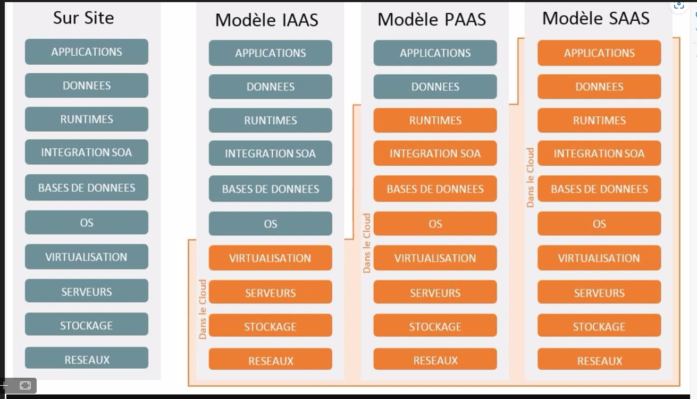
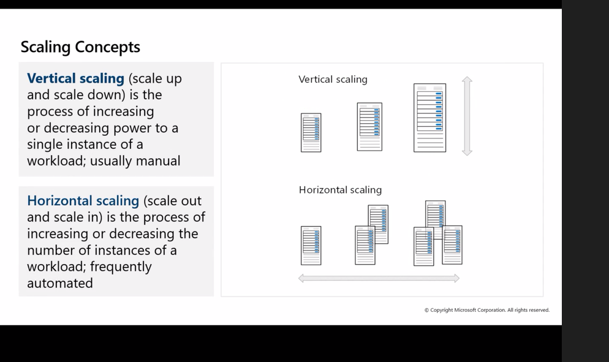

# Azure AZ-104
- [portal.azure.com](https://portal.azure.com/)

- [learn.microsoft.com study-guides/az-104](https://learn.microsoft.com/fr-fr/credentials/certifications/resources/study-guides/az-104)
- [learn.microsoft.com azure](https://learn.microsoft.com/fr-fr/azure)
- [learn.microsoft.com training/courses/az-104t00](https://learn.microsoft.com/fr-fr/training/courses/az-104t00)

- [skylinesacademy.com/az-104-ultimate-study-guide](https://www.skylinesacademy.com/az-104-ultimate-study-guide)
- [github.com /oliverbebber /AZ-104-Study-Notes](https://github.com/oliverbebber/AZ-104-Study-Notes)
- [github.com  MicrosoftLearning/AZ-104-MicrosoftAzureAdministrator](https://github.com/MicrosoftLearning/AZ-104-MicrosoftAzureAdministrator)

## Sujets de l'AZ-104
- Gérer les identités et la gouvernance Azure (20-25 %)
- Implémenter et gérer le stockage (15-20 %)
- Déployer et gérer les ressources de calcul Azure (20–25 %)
- Implémenter et gérer des réseaux virtuels (15-20 %)
- Superviser les ressources Azure et en assurer la maintenance (10–15 %)

## Définition du cloud
- Paiement à la demande
- Scalable
  - Monter en charge
    - Horizontale en augmentant les ressources par machines
    - Verticale en augmentant le nombre de runner
- Disponibilitée (Si une machine est HS)
- Localisation

## Modèle d'hébergement

- IAAS : Infrastructure as a service
- PAAS : Platform as a service
- SAAS : Software as a service

## Type de cloud
- Publique
  - Ouvert à tous pour louer une machine
  - Partagé
- Hybride
  - Mélange de cloud et d'hébergement sur site (On premise)
- Privé
  - Pour un seul client
- Vertical
  - Une partie du service est sur le cloud, et d'autres sur site
    - Exemple : Site sur cloud, et SQL sur site

## Gestion des identités et des accès
- Azurez AD (Entra ID)
  - Protocole REST
  - Oauth (V2)

- Créer une ressource
  - Afficher tout les services
  - Entra ID

## Hierarchie
- Compte
  - Tenant / Directory
    - Abonnement
      - Annuaire
        - Utilisateurs
        - Devices

## Utilisateurs
- Utilisateurs
  - Permet de créer un compte dans un tenant / locataire
- Utilisateurs externes
  - Permet de lier un compte déjà existant dans un tenant / locataire

## Groupes
- Sécurité
  - Permet de gérer des permissions par groupe
- Sécurité avec mail
  - Permet de gérer des permissions par groupe
  - Les utilisateurs peuvent recevoir des mails comme une liste de distribution
- Microsoft 365
  - Lié à Office 365
  - Messagerie, sharepoint, teams, ...

- Groupe de sécurité assigné
  - Doit assigner à la main des utilisateurs
- Groupe de sécurité dynamique
  - Permet d'y lier des utilisateurs par des règles (Exemple : Département = IT)

## Groupes de ressources
Permet de stocker des ressources (Stockage, VM, réseaux, ...)

## Création de ressource
- [azure.microsoft.com pricing/calculator](https://azure.microsoft.com/fr-fr/pricing/calculator/)
### Créer une VM complète
- Uniquement les heures consommés sont dues

- Machines virtuelles
- Bouton créer
  - Machine virtuelle azure
- Appliquer un groupe de ressources ou le créer (Unique sur le tenant)
- Appliquer un nom à la VM (Non unique)
- Appliquer une région
- Modifier la disponibilité et le type de sécurité
- Choisir un OS
- La taille de la machine (CPU et RAM)
- Un login / password
  - testAdmin
  - SuperUser1234
- La license (Si Windows OS)

### Créer un compte de stockage
- Créer un groupe de ressource
- Appliquer un nom (Unique)
- Sélectionner la région
- Séléctionner la redondance
### Réseaux
### ...

- La VM est disponible dans la liste des groupes de ressources
- En cliquant dessus vous pourrez vous y connecter (Connect > Connect > RDP)

- Le déploiement se fait via un JSON

## Supprimer des ressources
- Demander la suppression arrête la facturation

- Doit supprimer toutes les ressources (IP, réseau, disque, VM, ...)

- Dans groupes de ressources, cliquer sur Supprimer le groupe de ressources

## Plan d'économie
- Réduction sur engagement de durée
- La ressource peut être changé durant

- Cela correspond à un engagement de payement minimum mensuel durant la durée d'engagement peut-importe les changements après

## Templates
Deux fichiers : `parameters.json`, et `template.json`

### Déployer à partir d'un modèle personnalisé
- Onglet `Déployer à partir d'un modèle personnalisé`
- Créer votre propre modèle dans l'éditeur
- Coller le fichier `template.json` et enregistrer
- Bouton Modifier les paramètres
- Coller le fichier `parameters.json`et enregistrer
- Appliquer le groupe de ressource
- Puis déployer le modèle

### Déployer à partir d'un script
Via le cloud shell sur portail Azurez

- Cliquer sur le logo de shell
  - Sélectionner le type de langage (Shell ou PowerShell)
- Monter un compte de stockage
  - Sélectionner l'abonnement
- Choisir monter un compte de stockage pour vous

#### PowerShell
- `Get-Command *-AzResourceGroup` pour visualiser les commande AzResourceGroup

- module az.Ressources
- Menu Gérer les fichiers
  - uploader template.json et parameters.json
- Exemple pour créer un ressource group : `New-AzResourceGroup -Name ARM-NAME-Storage-test -Location francecentral`
- Exemple pour créer une ressource de stockage : `New-AzResourceGroupDeployment -ResourceGroupName ARM-NAME-Storage-test -TemplateFile ./template.json -TemplateParameterFile ./parameters.json`
- Exemple pour supprimer le ressource group : `Delete-AzResourceGroup -Name ARM-NAME-Storage-test`
#### AZ.exe (CLI)
- 

## ARM
Azure ressource manager

## Azure Storage Account
- Azure Blobs / container
  - Binary Large OBject (Non-Structuré)
- Azure Queues
  - File d'attente de traitement (Exemple passer d'une image à une miniature)
  - Similaire à des messages dans une liste d'attente
- Azure Tables
  - Semi structuré
  - Tableau
- Azure Files
  - File share

## Type de fichier
- Structuré : BDD, ...
  - Structure de donnée rigide
- Semi-Structuré : CSV, Docx, xlsx ...
  - Lisible par un humain
- Non structuré : Binaire, exe, img, ...
  - Ont besoin d'un exporer / logiciel pour le lire

## Azure data disk & box
Permet de transférer des donnés en grosse quantitée

- Data disk = 8 To
- Data box = 100 To
- Data box heavy = 1 Po
- Data box gateway = Via routage internet

## Azurez storage explorer
- [azure.microsoft.com /en-us/products /storage/storage-explorer/](https://azure.microsoft.com/en-us/products/storage/storage-explorer/)

## AZ-Copy
Mode bulk
- `$source = "C:\Users\User\Desktop\abc.md"`
- `$storage = "demostrcbn2702"`
- `$containername = "img"`
- `$SASToken = "sv=2022-11-02&ss=bfqt&srt=sco&sp=rwdlacupiytfx&se=2024-08-02T16:51:57Z&st=2024-08-02T08:51:57Z&spr=https&sig=dzQh%2FMO5hCVHXFVtfnjIN0xP6dXD82LvpLhh686bxac%3D"`

- `C:\Users\User\Desktop\azcopy.exe copy "$source" "https://$storage.blob.core.windows.net/$($containername)?$SASToken"`

## Storage
- Hot (Rapide + chère)
- Cool
- Cold (Lent + peut chère)
- Archive (Offline) Hydratation / déshydratation (Sérialise / desérialise)

Prix calculé à la volé

## Sécuriser des ressources
- Créer une ressource
  - Menu : Avancé
    - Désactiver REST
    - Activer les connexions anonymes
    - Sockage de clé
    - Default to microsoft entra authirization in the azure portal
    - TLS
  - Menu : Réseau
    - IP
    - Publique
    - Privé
    - Whitelist
  - Menu : Data Protection
    - Restauration par versionning
  - Menu : Encryption
    - Les clées d'encryption

- Clée d'accès (Token)
- Shared access signature (Token d'accès temporaire) (SAS)
  - Limite dans le temps + Génerer à la volée à partir du token
- Entra ID & IAM (Access control)

## Type de blob
- Block blob
  - Block de taille fixe (ex 1ko, 1024ko, ...)
  - Le blob doit être téléchargé au complet pour être lus
- Page blob
  - Block avec début et fin
  - Meilleur pour de la vidéo / audio
  - Permet la lecture en même temps que de télécharger le blob
  - L'offset se déplace comme un curseur pour télécharger la partie requise par le client
- Append blob
  - Pour des fichiers avec beaucoup d'écriture (Ex : logs)
  - L'offset reste à la fin du fichier

## Disques
- Managé
  - Azure est en charge du disque (Taille auto, répartition des données, SLA) (conseillé)
- Non managé
  - Deprecated

- throughput : débit
- IOPS : input/output operations per second

- Premium : Plus de performance
- Standard : Moins de performance

- HDD
- SSD
- NVME (Ultra disk)

## VM
- Taille (CPU, RAM, ...)
  - General purpose (B,D)
  - Compute optimized (CPU++) (F, FX)
  - Memory optimized (RAM++) (E, M, Dv2) (1CPU 8G)
  - Storage optimized (Disk++) (L)
  - GPU (N, A)
  - NPU (N) ARM
  - High-performane compute
- Une VM dispose de deux disques par défaut
  - Disque C par défaut 127 Gb
  - Disque temporaire variable
- Une 3ème disque devra être ajouté pour stocker des données

## Availability
Disponibilitée :
- Fault domains (Plusieurs marques / appareils de marques différents)

- Update domains : Plusieurs instances de machines afin d'éviter des coupures (Ex maintenance / MàJ)


- Cela va répartir à taux "égal" les machines dans chaques domaines
- Ex : 2 availability zone, 2 machines, cela va donner :
  - Z1 : 1
  - Z2 : 1
- Ex : 3 Availability zone, 4 machines, cela va donner :
  - Z1 : 2
  - Z2 : 1
  - Z3 : 1

- Availabilty set (VMSS) : Répartition de charge / Scaling
- Availabilty zone (Fault domains) : Haute disponibilité (En cas de panne)

## Régions
- Région (Exemple France - Central)
  - 3 zones (Espacé au minimum de 2.7 km)
    - 3 datacenter (côte à côte)
    - (5 en france)

## Rendonce
- LRS = Local redondent (Répliqué dans un groupe de datacenter)
- ZRS = Zone redondent (Repliqué dans un groupe de zone)
- GRS = Geo redondent (Réplique dans la zone géographique (Exemple France Sud + Central))
RA-ZRS : Read Access - Zp,e redondent
- RA-ZGRS : Read Access - Zone & Geo redondent

## Bastion
- P2P
- Passe par l'IP privé

## Nommage de VM
- Enironnement : Dev, prod, ...
- Emplacement : France, US-E, US-W, Asie, ...
- N° d'instance : 01, 02, 03, ...
- Produit / service déployé dessus : VM, Network, Storage, ...
- Rôle de la VM : SQL, BDD, Messagerie,

Peut-être ajouté : 
- Projet : SuperProjectN, Altherneum
- Version de l'OS : Windows 10, Ubuntu 20.04, ...

## Extensions
- Applications (Ex : AntiVirus, GPU Driver, Script deployer...)
- Présent dans le fichier ARM (Script de déploiement)

- Temporaire ou permanent
- 1h30 max

## Run Command Script
Sur une VM > Opérations > Run Command :
- `Install-WindowsFeature -name Web-Server -IncludeManagementTools`
- Puis ouvrir les ports HTTP & HTTPS en règle de paquet entrant
- Ouvrir le même port en sortant car Azure dispose de sa propre gestion du pare-feu

## Pare-feu
Le pare-feu est le `Network security group`

## Scaling
- Vertical :
  - Augmentation des ressources d'une machine (Ex : RAM, CPU, ...)
- Horizontal :
  - Ajout de nouvelles machines / instances

- Scale out : monté en charge / augmentation des ressources
- Scale in : Descente de charge / réduction des ressources



## PWSH Lab 08 New AZ VM
```
New-AzVm `
-ResourceGroupName 'az104-rg8-djb' `
-Name 'myPSVM' `
-Location 'France Central' `
-Image 'Win2019Datacenter' `
-Zone '1' `
-Size 'Standard_D2s_v3' `
-Credential (Get-Credential)
```

## Local AZ shell
- [learn.microsoft.com/en-us/powershell/module/az.accounts/connect-azaccount?view=azps-12.1.0](https://learn.microsoft.com/en-us/powershell/module/az.accounts/connect-azaccount?view=azps-12.1.0)

- `install-module az.*` (Installer les modules AZ)
  - Exemple `install-module az.Account`
  - ou `install-module az.compute`
- `Connect-AzAccount` (Ouvre un GUI)

### via Credential (organizational ID credentials)
- `$Credential = Get-Credential`
- `Connect-AzAccount -Credential $Credential`

### via Credential (service principal account)
- `$SecurePassword = Read-Host -Prompt 'Enter a Password' -AsSecureString`
- `$TenantId = 'yyyyyyyy-yyyy-yyyy-yyyy-yyyyyyy'`
- `$ApplicationId = 'zzzzzzzz-zzzz-zzzz-zzzz-zzzzzzzz'`
- `$Credential = New-Object -TypeName System.Management.Automation.PSCredential -ArgumentList $ApplicationId, $SecurePassword`
- `Connect-AzAccount -ServicePrincipal -TenantId $TenantId -Credential $Credential`

### via Tenant (specific tenant and subscription)
- `Connect-AzAccount -Tenant 'xxxx-xxxx-xxxx-xxxx' -SubscriptionId 'yyyy-yyyy-yyyy-yyyy'`

## App Service
- Windows (IIS), ou fork d'ubuntu (NGinx)
- PAAS (Pas d'accès OS)

- Emplacement, scaling, instances, ... à configurer

- Deployment slots = Prod, Qualif, test, beta, alpha...
  - Reconfiguré via DNS lors d'une mise à jour du slot

- Fonction sur azure : `App service plan`

## Azure DNS
- Centralise DNS local (Interne / Intranet) et cloud (Web)

## Network
- Virtual network = Réseau
- Subnet = sous réseau
- NIC = Network interface cable = Carte/Interface réseau virtuelle

- 255 subnet par virtual network

- Doit être dans la même région (performance et coût)

- 4 Adresses réservés
  - `x.x.x.0` Azure fabric (Hyperviseur)
  - `x.x.x.1` Supervision
  - `x.x.x.2` permet de faire communiquer les ressources (Agent de communication)
  - `x.x.x.3` gateway

## firewall
- Network security group
- ou Azure firewall

# Sku
Basic = static IP ou dynamique et redondence
Standard = static IP

## Tenant
Un tenant permet de séparer la facturation, les projets/entreprises, et permet de gérer une sorte d'annuaire

## Abonnement
- Free (Période de test, 200€ sur 30 jours, tiers free limité à 12 mois)
- Pay as you go (Au mois)
- CSP (crédit données à des petites à moyenne entreprises avec un contrat Microsoft avec réduction)
- Entreprise (Grandes entreprises avec contrat Microsoft avec réduction)
- Student (100€ sur 12 mois)
- ...

## Azure policy
Règle sur azure (Ex règle de nommage, création dans des régions, ...)

## IAM
Access control
- Utilisateurs
  - Owner (A crée une ressource)
  - Contributeur (A participé à une ressource)
- Rôles
  - Power shell : `get-AzRoleDefinition`, `get-AzRoleDefinition | ft name, description`
  - 567 rôles
- ...