```mermaid
mindmap
  root((Altherneum))
    (Présentation)
      (FOSS Self hosted multi-purpose server)
      (Altherneum.fr)
    (Liste des repository)
      (bot - Bot Discord JavaCord)
      (.github - Notes et cours)
      (plugin - Plugin Spigot)
      (server - Serveur Ubuntu et ses scripts)
      (ResourcePack - Pack de texture Minecraft pour le serveur)
```

- Exemple : [Github.com/Altherneum/.github/blob/main/note/Github/mind-map.md](https://Github.com/Altherneum/.github/blob/main/note/Github/mind-map.md)
- [Creating diagrams](https://docs.github.com/fr/get-started/writing-on-github/working-with-advanced-formatting/creating-diagrams#creating-mermaid-diagrams)